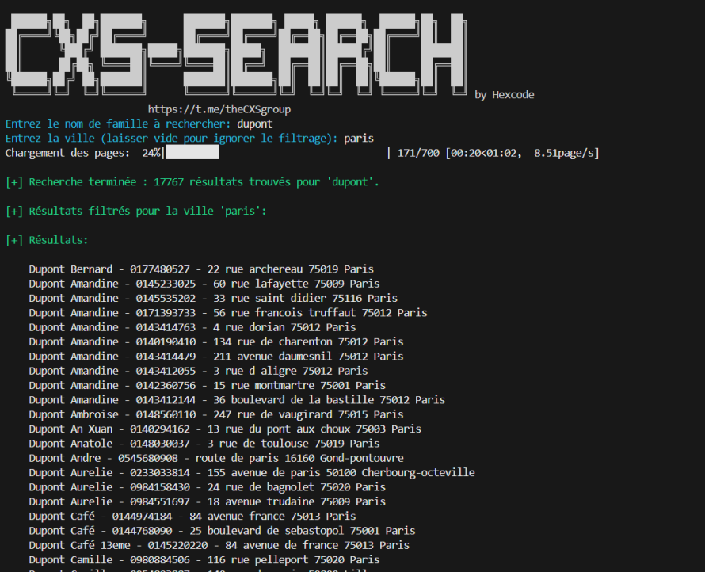

# Recherche Avancée dans un Annuaire en Ligne (CXS-Search)
<p align="center">
   
🚀 **Optimisez vos recherches dans les annuaires en ligne avec ce script Python simple et efficace !**

Ce script vous permet de rechercher rapidement des informations (telles que le téléphone et l’adresse) à partir des noms de famille dans un annuaire en ligne. Grâce à des fonctionnalités avancées, vous pouvez récupérer des données rapidement, filtrer les résultats par ville, et gérer les erreurs de manière transparente. Idéal pour les recherches massives et répétitives !

## Caractéristiques principales :

🔍 **Recherche rapide et étendue** :  
Trouvez facilement des informations relatives à un nom de famille dans un annuaire en ligne.

🌆 **Filtrage par ville** :  
Affinez vos résultats en fonction de la ville d’un individu, si vous en avez besoin.

⚙️ **Multithreading** :  
Exécutez plusieurs recherches en parallèle pour gagner du temps.

⏳ **Gestion des erreurs** :  
En cas d’erreur, le script reprend sans interruption, ce qui garantit une recherche stable.

🛠️ **Facile à utiliser** :  
Une interface simple à travers le terminal, accessible même pour les débutants.

📊 **Suivi en temps réel** :  
Profitez d'une barre de progression pour suivre l'état de votre recherche en direct.

🔄 **Recherches continues** :  
Relancez facilement une nouvelle recherche sans avoir à redémarrer le script.

## Pourquoi utiliser ce script ?

- **Gain de temps** : Automatisez la recherche dans un annuaire en ligne, vous permettant ainsi de vous concentrer sur l’analyse des données.
- **Fiabilité** : Profitez d'une gestion robuste des erreurs pour ne jamais perdre le fil de votre recherche, même si une page échoue.
- **Optimisation des ressources** : Grâce au multithreading, plusieurs recherches peuvent être effectuées simultanément, ce qui vous permet de traiter un grand volume de données efficacement.
- **Personnalisable** : Modifiez facilement le script pour l’adapter à d'autres annuaires en ligne, ou ajouter des fonctionnalités supplémentaires.

  
- **Update**
```
- Amelioration du multicoeurs
- User-Agent
```  
  
## Instructions :

### Prérequis :
Assurez-vous d’avoir **Python 3.x** installé sur votre machine et d’avoir les bibliothèques suivantes :

```bash
requests
beautifulsoup4
colorama
tqdm
